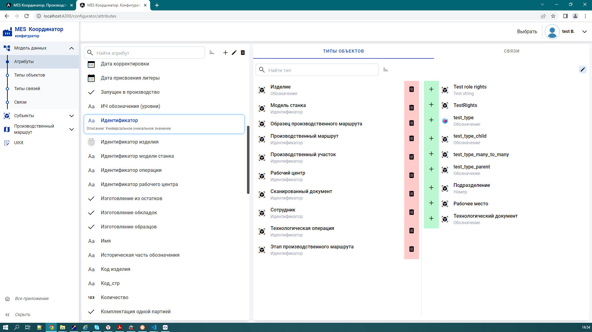
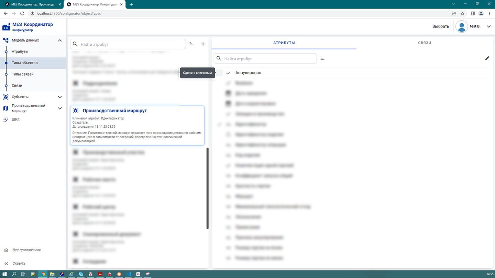
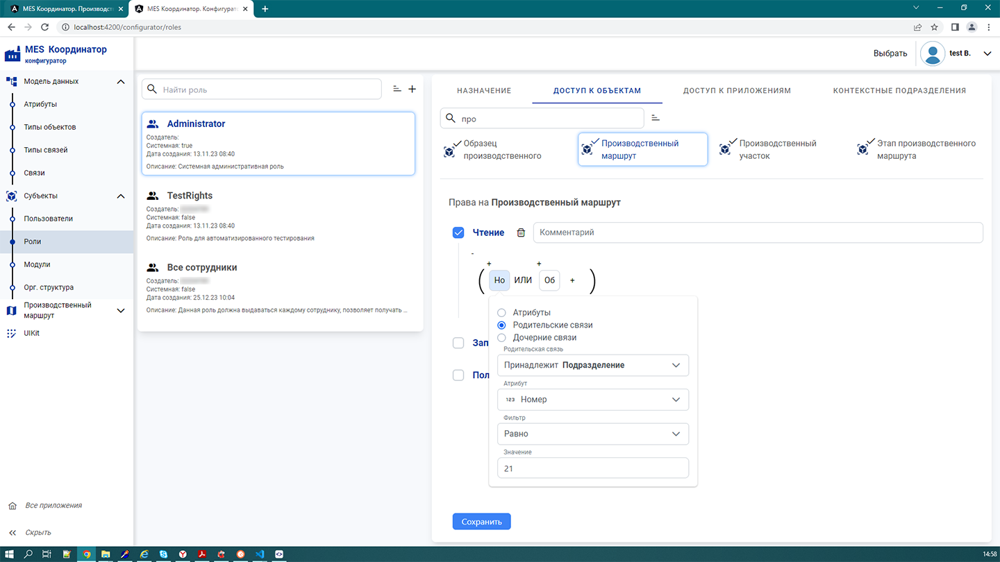
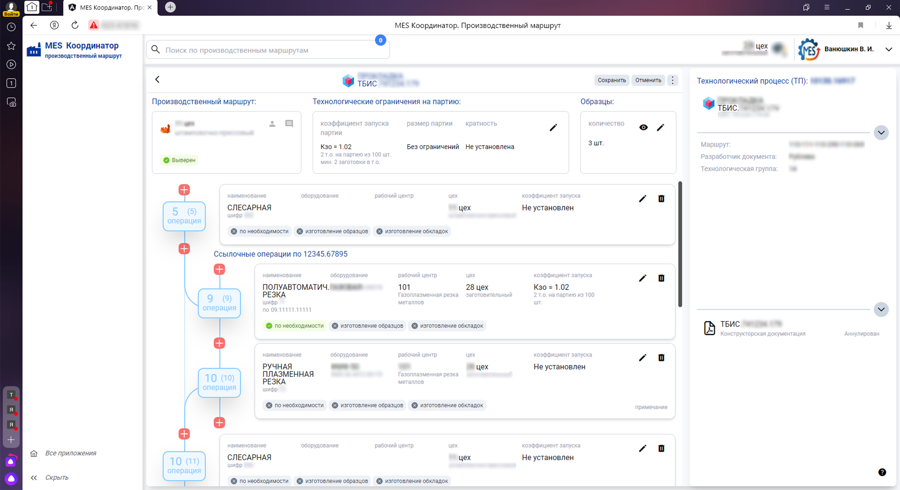
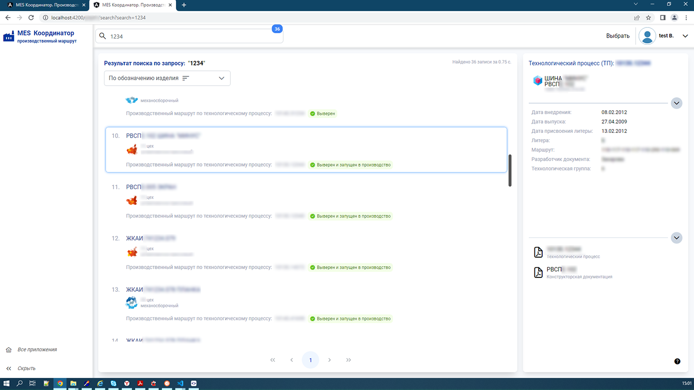

# Система управления производством. MES КООРДИНАТОР

Проект, созданный для внутренних нужд и потенциальной продажи в качестве коробочного решения.

### Работы, выполненные в рамках проекта

* Разработка архитектуры проекта, функциональных требований к сервисам и их состав, определение интерфейсов для работы с проектом как со стороны разработчика, так и со стороны потенциального покупателя

* Разработка функционала гибкой модели данных, обеспечение высокой степени адаптивности функционала  

* Разработка мощного механизма ограничения доступа, настраиваемого без необходимости изменения кодовой базы

* Обеспечение механизма запроса данных, позволяющего выполнять поиск по множественным критериям по сотням тысяч бизнес-объектов менее чем за 1 секунду

* Обеспечение механизма разграничения доступа, который распространяется на любой запрос пользователя и оказывает минимальное влияние на скорость системы

* Проектирование дальнейшего пути развития проекта

* Проектирование решения для "горячего" внедрения частей системы на место существующих с сохранением бизнес-связей между модулями и сохранением существующих данных

* Разделение системы на "ядро" и вспомогательные части, позволяющие максимально приспособить систему к внутренним нуждам предприятия с сохранением гибкости, необходимой для потенциальной продажи и внедрения на производстве с иными требованиями

* Обеспечение высокой степени тестового покрытия ядра системы

### Архитектура

К проекту изначально были предъявлены крайне высокие требования:
1. необходимость применения веб-стеке (было мало опыта разработки)
2. необходимость внедрения частей системы по мере разработки
3. полная обратная совместимость c существующей системой
4. высокая степень гибкости модели данных при использовании PostgreSQL в качестве основной БД (был навязан паттерн EAV - entity-attribute-value для базы данных)
5. высокая надежность и быстродействие системы с сохранением гибкости
6. фактическая необходимость выполнять все эти требования в одиночку 

Первые несколько месяцев были направлены на разрешение этих вопросов - если решались проблемы со скоростью, они жертвовали гибкостью, гибкость жертвовала скоростью разработки и квалификацией разработчика, необходимой для работы с такой системой. Огромное количество проблем, возникших из-за использования EAV паттерна не позволяли продвигаться с разработкой

Большая часть этих проблем были решены при помощи ручного индексирования - объединения всей информации из ~15 таблиц, составляющих EAV, в единое JSON представление в одной таблице, и ведение дальнейшей работы, опираясь на более ясное представление с понятными запросами и простым индексированием

Каждый бизнес-объект конфигурируем из интерфейса модуля администрирования, внешний вид экранов приведён ниже

### API

Следующей проблемой являлась работа с данными - были необходимы понятные интерфейсы для работы с данными - запросы на чтение, запись, фильтрация данных должны были быть универсальными для обеспечения гибкости системы даже при отсутствии доступа к исходному коду 

В качесте решения в ядре системы был разработан API как для просмотра, так и для изменения данных с учетом связей между объектами, полным сохранением версий при каждом изменении, полным соответствованием ACID требованиям при множественном изменении данных, возможностью валидации каждой характеристики объекта и всё это с полным учётом прав пользователя 

### Ограничение доступа

Для ограничения доступа был разработан функционал, позволяющий ограничивать как просмотр, так и редактирование любого объекта по любому его признаку или признаку связанного с ним объекта 

Например, есть справочник сотрудников, каждый из сотрудников работает в каком-то подразделении. В системе можно обеспечить права на просмотр только пользователей цеха 48, редактирование только тех пользователей из этого цеха, которые были устроены на предприятие ранее 2022 года.

И всё это без написания и строки кода, на скриншоте ниже внешний вид интерфейса

### Разработка бизнес-логики

На созданном ядре можно быстро разрабатывать бизнес-приложения со сложными связями между сущностями, абстрагируясь от большей части логики по реализации этих связей. Первым модулем, а также прототипом для MES выступил "Производственный маршрут". На примере этого модуля была проверены модель разграничения доступа, производительность работы с данными при помощи ядра системы, связи между объектами с отношениями "один ко многим", "многие ко многим", результаты:

1. Поиск по 100.000 производственным маршрутам (частичное совпадение по любому из трёх атрибутов) занимает менее 1 секунды
2. Поиск по 300.000 документов по частичному совпадению одного атрибута занимает менее 0.5 секунд
3. Сохранение маршрута с 30 операциями и 5 образцами (связи многие ко многим) с сохранением версионности занимает менее 2 секунд. В базе данных за это время появляется более 300 строк, представляющих новую версию объекта

Видеокадр просмотра и редактирования маршрута:

Видеокадр поиска производственных маршрутов:

